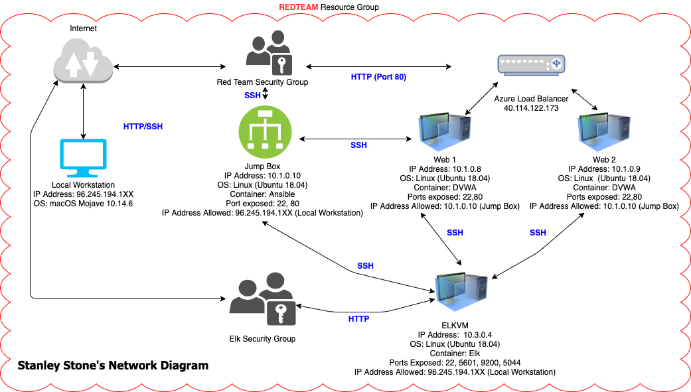
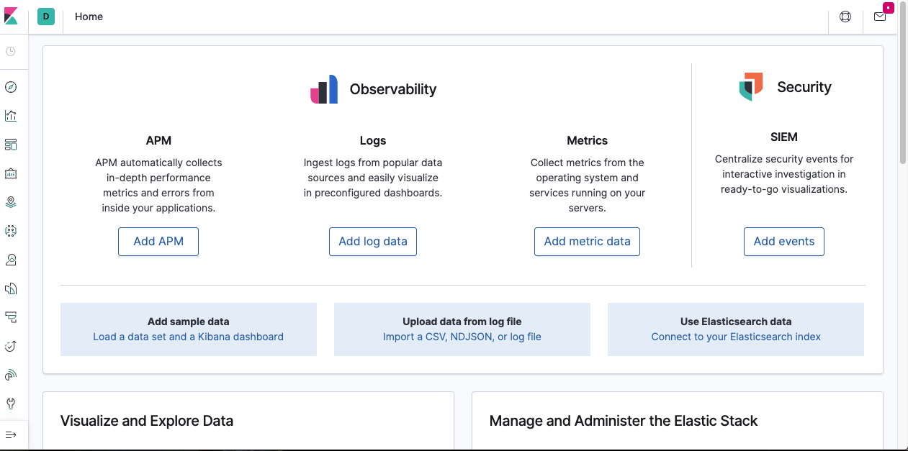

## Automated ELK Stack Deployment

The files in this repository were used to configure the network depicted below.



These files have been tested and used to generate a live ELK deployment on Azure. They can be used to either recreate the entire deployment pictured above. Alternatively, select portions of the playbook file may be used to install only certain pieces of it, such as Filebeat.

  ```
  - name: Configure Elk VM with Docker
    hosts: elk
    remote_user: azadmin
    become: true
    tasks:
      # Use apt module
      - name: Install docker.io
        apt:
          update_cache: yes
          force_apt_get: yes
          name: docker.io
          state: present

      # Use apt module
      - name: Install python3-pip
        apt:
          force_apt_get: yes
          name: python3-pip
          state: present

      # Use pip module (It will default to pip3)
      - name: Install Docker module
        pip:
          name: docker
          state: present

      # Use command module
      - name: Increase virtual memory
        command: sysctl -w vm.max_map_count=262144

      # Use sysctl module
      - name: Use more memory
        sysctl:
          name: vm.max_map_count
          value: 262144
          state: present
          reload: yes

      # Use docker_container module
      - name: download and launch a docker elk container
        docker_container:
          name: elk
          image: sebp/elk:761
          state: started
          restart_policy: always
        # Please list the ports that ELK runs on
          published_ports:
            -  5601:5601
            -  9200:9200
            -  5044:5044
 ```
This document contains the following details:
- Description of the Topology
- Access Policies
- ELK Configuration
  - Beats in Use
  - Machines Being Monitored
- How to Use the Ansible Build


### Description of the Topology

The main purpose of this network is to expose a load-balanced and monitored instance of DVWA, the D*mn Vulnerable Web Application.

Load balancing ensures that the application will be highly available, in addition to restricting traffic to the network.
  
Load balancers protects applications from emerging threats and DDoS attacks. It protects the availability aspect. The advantage of a jump box is providing more security. Jump boxes are secure computers that admins connect to use as a starting point to connect to other servers.

Integrating an ELK server allows users to easily monitor the vulnerable VMs for changes to the logs and system traffic.


Filebeat watches for log files/locations and collects log events.


Metricbeat collects metrics and statistics and ships them to the outputs that you want them to go.

The configuration details of each machine may be found below.


| Name     | Function        | IP Address | Operating System |
|----------|-----------------|------------|------------------|
| Jump Box | Gateway         | 10.1.0.10  | Linux            |
| Web-1    | UbuntuServer    | 10.1.0.8   | Linux            |
| Web-2    | UbuntuServer    | 10.1.0.9   | Linux            |
| ELKVM    | UbuntuServer    | 10.3.0.4   | Linux            |

### Access Policies

The machines on the internal network are not exposed to the public Internet. 

Only the Jump Box machine can accept connections from the Internet. Access to this machine is only allowed from the following IP addresses:
- 96.245.194.1XX

Machines within the network can only be accessed by me. The Jump Box is allowed to access my ELK VM via Ansible. The IP address is 10.1.0.10.

A summary of the access policies in place can be found in the table below.

| Name     | Publicly Accessible | Allowed IP Addresses |
|----------|---------------------|----------------------|
| Jump Box | Yes                 | 96.245.194.1XX       |
| Web-1    | No                  | 10.1.0.10            |
| Web-2    | No                  | 10.1.0.10            |
| ELKVM    | Yes                 |96.245.194.1XX, 10.1.0.10            |

### Elk Configuration

Ansible was used to automate configuration of the ELK machine. No configuration was performed manually, which is advantageous because you can put commands from multiple servers into a single playbook. 

The playbook implements the following tasks:
  
- Install docker.io
- Install python3-pip
- Install docker module
- Increase and use virtual memory
- Download and install docker elk container

The following screenshot displays the result of running `docker ps` after successfully configuring the ELK instance.


### Target Machines & Beats
This ELK server is configured to monitor the following machines:

Web-1 10.1.0.8
Web-2 10.1.0.9

We have installed the following Beats on these machines:
- Metricbeat
- Filebeat.

These Beats allow us to collect the following information from each machine:
- Filebeat collects all of the changes made on a machine. 
- Metricbeat collects metrics and statistics.

### Using the Playbook
In order to use the playbook, you will need to have an Ansible control node already configured. Assuming you have such a control node provisioned: 

SSH into the control node and follow the steps below:
- Copy the YAML file to Ansible.
- Update the config file to include the webserver's ip address
- Run the playbook, and navigate to Kibana using the public IP address of your webserver and the port you used to check that the installation worked as expected. http://13.66.50.200:5601/app/kibana#home

